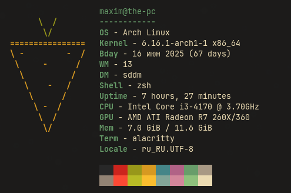

# Yofetch
Yofetch is a fast, minimal system fetch tool written in Go.

Information about the API configuration can be found [here](LuaConfigInfo.md).

## Features
- Fast & portable
- Configurable via Lua API
- Minimal dependencies
- Cross-platform

> Dependencies: [pflag](https://github.com/spf13/pflag), [gopher-lua](https://github.com/yuin/gopher-lua)

# Platforms

- Linux x64: prebuilt binaries available.  
- Windows, macOS, FreeBSD: manual compilation required.

## Tested OS
- Linux:
  - Arch Linux glibc x64

# Contributing
Pull requests are welcome - please keep speed and minimalism in mind.  
Report issues [here](https://github.com/TheMomer/yofetch/issues).
